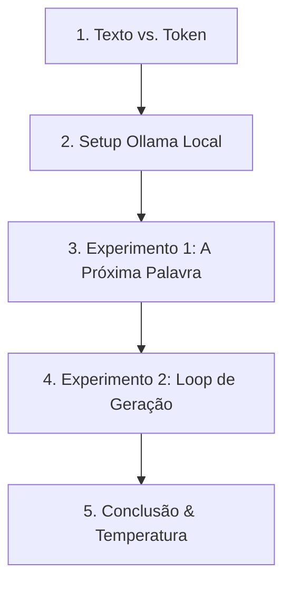

# 📋 Estrutura de Aula: Como a IA "Prevê" a Próxima Palavra

Esta aula prática em Jupyter Notebook tem como objetivo desmistificar o funcionamento de Grandes Modelos de Linguagem (LLMs). Através de um experimento local com o Ollama, os alunos entenderão visualmente que a IA não compreende o texto de forma cognitiva, mas sim calcula probabilidades estatísticas sobre representações numéricas (tokens).

---

## 🧭 Visão Geral do Fluxo do Notebook



---

## 1. Introdução: O Mito do "Entendimento" 🧠
**Objetivo:** Provar que a IA não lê como humanos, mas sim processa e prevê sequências numéricas.

* **Analogia de Abertura:** O corretor ortográfico do celular "com esteroides".
* **Conceito Chave (Tokenização):** 
  * Mostrar que o texto é fatiado em pedaços (tokens).
  * Explicar que cada token possui um ID numérico exclusivo dentro de um dicionário (vocabulário do modelo).
* **Atividade Visual no Notebook:**
  * Apresentar uma string em português (ex: `"O gato roeu a roupa"`).
  * Exibir visualmente como essa frase é quebrada em tokens com cores alternadas e seus respectivos IDs numéricos.

## 2. Configurando o Ambiente Local (Ollama) 🛠️
**Objetivo:** Preparar o Jupyter Notebook e conectar-se à API local do Ollama para extrair os dados de probabilidade brutos.

* **Escolha do Modelo:** Recomendar um modelo leve e rápido (ex: `llama3:8b`, `phi3` ou `gemma2:2b`) para rodar em computadores comuns.
* **Acesso à API Básica:**
  * Explicar o uso da biblioteca `requests` do Python para conversar diretamente com o endpoint `/api/generate` ou `/api/chat`.
  * Demonstrar como travar o modelo para gerar exatamente **1 token por vez** utilizando os parâmetros estruturados:
    ```python
    options = {
        "num_predict": 1,
        "temperature": 0.0 # Determinístico para o primeiro teste
    }
    ```

## 3. Experimento 1: A Próxima Palavra Mais Provável 🎲
**Objetivo:** Interromper a execução do modelo no exato momento da escolha do próximo token e expor a lista de alternativas cogitadas.

* **O Prompt Incompleto:** Usar frases fortemente previsíveis em português, como:
  * *"Batatinha quando nasce, espalha rama pelo..."*
  * *"Água mole em pedra dura, tanto bate até que..."*
* **O Segredo Técnico:** Ativar o parâmetro `logprobs` na requisição do Ollama. Isso instrui o modelo a devolver não apenas o token vencedor, mas o **Top 5 de tokens alternativos** com suas respectivas probabilidades logarítmicas.
* **Visualização de Dados:** 
  * Criar um script simples para converter os `logprobs` em porcentagens reais de chance (0% a 100%).
  * Plotar um gráfico de barras horizontal usando `matplotlib` ou `seaborn` mostrando o ranking de apostas da IA (ex: `chão: 94%`, `solo: 3%`, `ar: 1%`).

## 4. Experimento 2: Gerando Texto Passo a Passo 🔄
**Objetivo:** Construir um loop de geração manual, revelando a "matemática viva" à medida que o texto se desenvolve.

* **A Dinâmica do Loop:** Construir uma função em Python que executa os seguintes passos sequenciais:
  1. Envia o prompt atual para o Ollama.
  2. Captura o próximo token previsto e sua porcentagem de certeza.
  3. Concatena (adiciona) esse token ao prompt original.
  4. Imprime na tela o token gerado colorido pelo nível de confiança da IA (ex: verde para >80%, amarelo para <50%).
  5. Repete o processo por 5 a 10 iterações.
* **Resultado Esperado na Tela:** 
  `[O (99%)] -> [Gramado (91%)] -> [está (88%)] -> [lindo (74%)]`

## 5. Temperatura e Conclusão: Estatística vs. Criatividade 🛑
**Objetivo:** Consolidar os conceitos, demonstrando como parâmetros matemáticos simulam o comportamento "criativo" ou geram alucinações.

* **O Experimento da Temperatura:** 
  * Rodar o mesmo prompt incompleto do Passo 3 com `temperature: 1.2`.
  * Mostrar aos alunos como o gráfico de barras se achata e o modelo passa a escolher opções menos prováveis, mudando completamente o rumo do texto.
* **Recapitulação Pedagógica:**
  * Reforçar que a IA não sabe o significado real de nenhuma palavra criada.
  * O modelo simplesmente calcula que, dada a sequência numérica anterior, o token X tem a maior probabilidade estatística de vir a seguir com base nos textos em que foi treinado.
